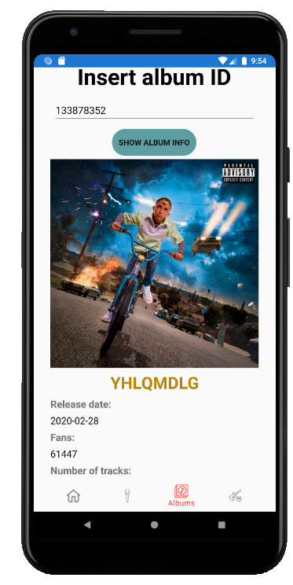
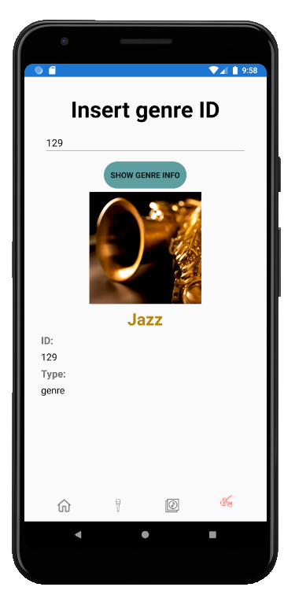

# NotSpotifyApp

NotSpotifyApp is a app sample under development for the mobile app development course at the Instituto Tecnológico de Santo Domingo. NotSpotifyApp is an app that retrieves its data from Deezer API allowing you to search an artist,album or genre by it's Deezer ID and finally displaying its info on screen. Developed using Xamarin Forms and Prism Framework. 

- Used API: (https://rapidapi.com/deezerdevs/api/deezer-1)
 
 <h2 style="text-align: center;"><strong>ArtistPage screen</strong></h2>

  

<h2 style="text-align: center;"><strong>AlbumPage screen</strong></h2>

 

  
<h2 style="text-align: center;"><strong>GenrePage screen</strong></h2>

 
