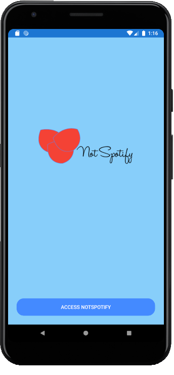
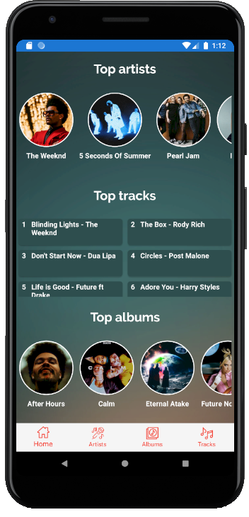
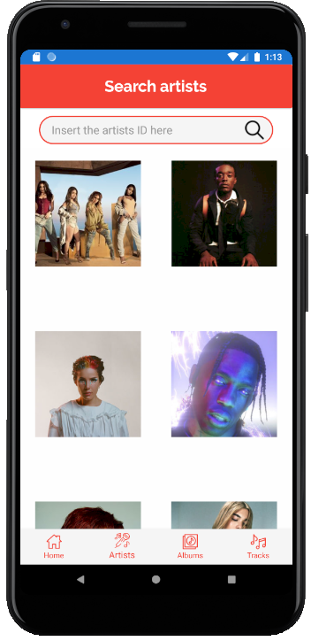
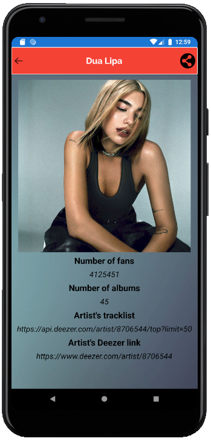
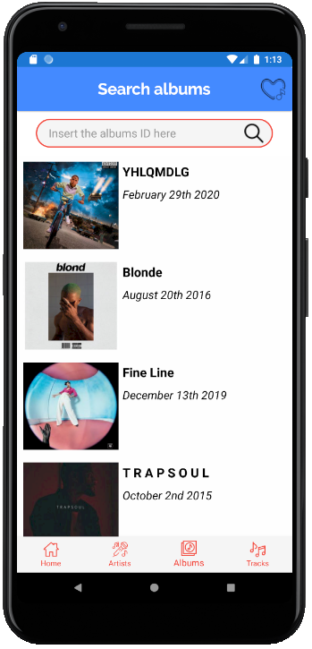
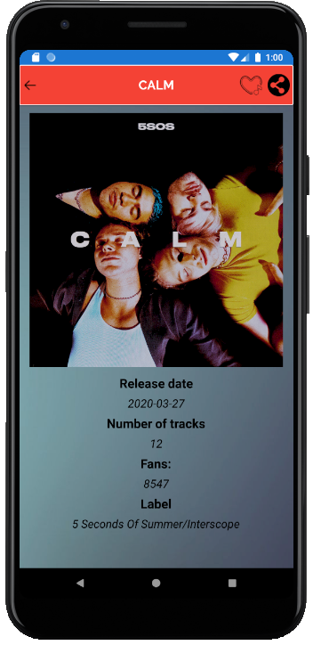
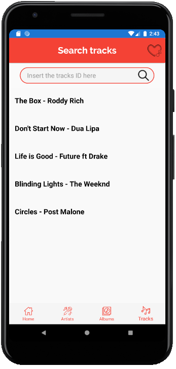
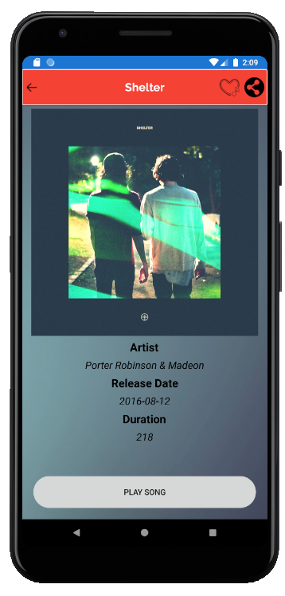
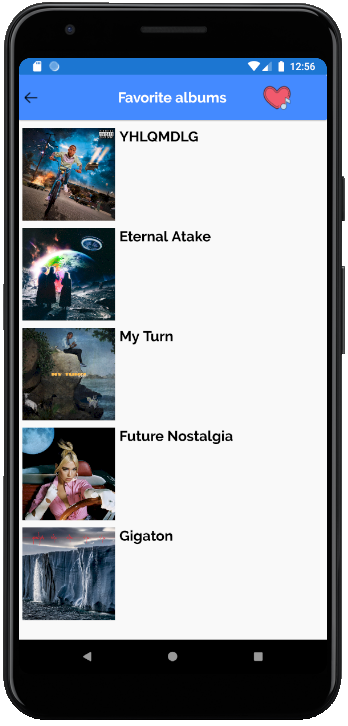
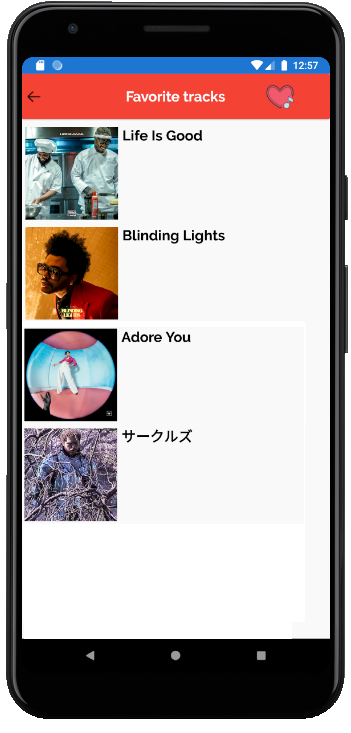

# NotSpotifyApp
NotSpotifyApp is an app that retrieves its data from the Deezer API, allowing you to search for an artist, album or track by it's Deezer ID and finally displaying its info on screen. It also allows you to add your favorite albums, tracks and also allows you to play music. 

## Team members

- [José Mendoza](https://github.com/Joseph2700)

- [Sebastián Soto](https://github.com/ssmatos)

- [Ambar Cuevas](https://github.com/Ambarcb)

## AppInfo

- [App Mockup](https://imgur.com/NZqnlSp)  
- [Trello board URL](https://trello.com/b/FoXJ3IcV/notspotifyapp)
- [Deezer API](https://rapidapi.com/deezerdevs/api/deezer-1)
 
# App screenshots
 
## AccesPage, HomePage and SongPlayerPage
<table>
<tr>
<td></td>
<td>   </td>
<td></td>
<td>   </td>
<td></td>
</tr>
</table>

## ArtistPage and ArtistInfoPage
<table>
<tr>
<td></td>
<td>   </td>
<td></td>
</tr>
</table>

## AlbumPage and AlbumInfoPage
<table>
<tr>
<td></td>
<td>   </td>
<td></td>
</tr>
</table>

## TrackPage and TrackInfoPage
<table>
<tr>
<td></td>
<td>   </td>
<td></td>
</tr>
</table>

## FavoriteAlbumsPage and FavoriteTracksPage
<table>
<tr>
<td></td>
<td>   </td>
<td></td>
</tr>
</table>

<h2 style="text-align: center;"><strong>Tools used</strong></h2>

- PropertyChanged.Fody - Handles property changed events.
  https://github.com/Fody/PropertyChanged

- MonkeyCache.FileStore - Cache any data structure for any amount of time in any .NET application.
  https://github.com/jamesmontemagno/monkey-cache

- Xamarin.Essentials - Essential cross platform APIs for your mobile apps.
  https://github.com/xamarin/Essentials

- Acr.UserDialogs - A cross platform library that allows you to call for standard user dialogs. 
  https://github.com/aritchie/userdialogs

- Plugin.Fingerprint - Plugin for authentication via fingerprint sensor.
  https://github.com/smstuebe/xamarin-fingerprint

- Plugin.Share - Plugin used to share links on social networks.
  https://github.com/jguertl/SharePlugin

- Xam.Plugin.SimpleAudioPlayer - Plugin that plays loca files and audio data as stream. 
  https://github.com/adrianstevens/Xamarin-Plugins/tree/master/SimpleAudioPlayer

- Newtonsoft.Json - JSON framework for .NET.
  https://github.com/JamesNK/Newtonsoft.Json

- Prism.Unity.Forms - MVVM framework for Xamarin.Forms applications with Prism and Unity.
  https://github.com/PrismLibrary/Prism

- FlatIcons Icons - Free vector icons. 
  https://www.flaticon.com
